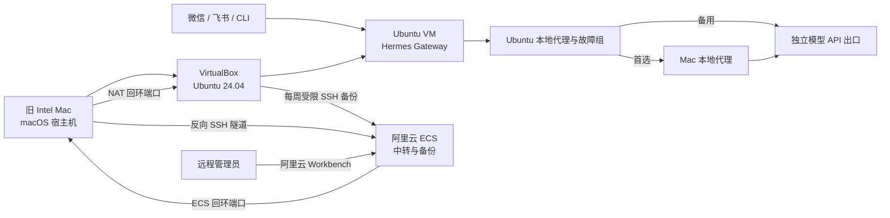

# Hermes Local Deployment Runbook

一套经过实际迁移与端到端验证的个人 Hermes Agent 部署方案：

- 旧 Intel Mac 作为 7×24 小时宿主机
- VirtualBox 中的 Ubuntu 24.04 LTS 作为唯一主运行环境
- 微信与飞书消息统一接入本地 Hermes Gateway
- ChatGPT Codex 订阅作为主模型，DeepSeek 作为跨提供商故障备用
- Ubuntu 通过受管 SSH 隧道复用 macOS 上的本地代理
- 阿里云 ECS 仅作为远程运维中转与异机备份节点
- 每周自动备份 Hermes 的人格、记忆、Skills、会话、任务和配置

本仓库只保存可复用的架构、模板和操作手册。真实 IP、用户名、密钥、Token、密码、账号 ID 与备份文件均不得提交。

## 当前架构

核心原则：

1. Ubuntu VM 是唯一主 Hermes 节点。
2. 云端 Hermes Gateway 保持关闭，避免双实例同时收消息。
3. 远程 SSH 只通过 ECS 回环地址转发，不直接暴露旧 Mac 或 VM。
4. 备份账号使用强制命令，不能获取 Shell、TTY 或端口转发。
5. 任何凭证只保存在受限配置文件中，不进入 Git。

当前生产状态（2026-08-29）：Shadowrocket 经受管 SSH 隧道是已验收的首选网络路径，Codex 端点和 Hermes 真实 GPT 调用均已恢复。Ubuntu 独立节点的“两地区备用组”仍是候选能力：51 个订阅节点的受控实测只得到韩国 2 个、日本 1 个同时通过 Auth 与 Codex，未满足“2 个地区且每区至少 2 个可用节点”的上线门槛，因此没有安装候选配置，生产配置已恢复原样。

## 仓库内容

| 路径 | 用途 |
|---|---|
| [`docs/architecture.md`](docs/architecture.md) | 三层架构、启动链路和故障边界 |
| [`docs/gpt-hermes-deployment.md`](docs/gpt-hermes-deployment.md) | 从 Ubuntu 基线到 GPT/Codex、Gateway 与生产验收的完整实施步骤 |
| [`docs/migration-runbook.md`](docs/migration-runbook.md) | 从云端迁移到本地唯一主节点的执行顺序 |
| [`docs/operations.md`](docs/operations.md) | 日常检查、启停、故障定位与切换规则 |
| [`docs/models-and-proxy.md`](docs/models-and-proxy.md) | Sol/Luna/DeepSeek 模型路由与 Mac 代理复用方案 |
| [`docs/qa-and-troubleshooting.md`](docs/qa-and-troubleshooting.md) | 本次真实部署遇到的 QA、症状判断与恢复方法 |
| [`docs/backup-and-restore.md`](docs/backup-and-restore.md) | 备份范围、保留策略、验证与恢复流程 |
| [`docs/security.md`](docs/security.md) | 凭证、网络暴露、双实例与 GitHub 安全边界 |
| [`docs/hermes-context-prompt.md`](docs/hermes-context-prompt.md) | 可直接同步给 Hermes 的长期环境 Prompt |
| [`scripts/guest/hermes-core-backup.sh`](scripts/guest/hermes-core-backup.sh) | Ubuntu 侧一致性核心数据备份脚本模板 |
| [`scripts/guest/mihomo_refresh_fallbacks.py`](scripts/guest/mihomo_refresh_fallbacks.py) | 隔离/受控线上探测、地区分组与失败恢复工具 |
| [`scripts/cloud/hermes-backup-receive.sh`](scripts/cloud/hermes-backup-receive.sh) | ECS 侧接收、校验与动态保留脚本模板 |
| [`tests/test_mihomo_refresh_fallbacks.py`](tests/test_mihomo_refresh_fallbacks.py) | 代理探测、筛选、配置事务与恢复行为回归测试 |
| [`configs/`](configs/) | systemd、sshd 与 macOS LaunchDaemon 示例 |

## 参考资源配置

已经验证过的基线：

- 宿主机：Intel 双核、8GB RAM 的 MacBook Air
- 虚拟机：Ubuntu 24.04 LTS x86_64
- VM 内存：约 5GB
- VM Swap：2GB，`vm.swappiness=10`
- VM 系统盘：20GB
- Hermes：Gateway、Playwright Chromium、本地 `faster-whisper-small`

这是低成本可用配置，不是高并发配置。浏览器、语音识别和多个长任务并发时需要关注内存峰值。

## 部署顺序

1. 配置 Mac 远程登录、电源策略和反向 SSH 隧道。
2. 安装 VirtualBox 与 Ubuntu Server VM，配置 NAT SSH 转发。
3. 在 Ubuntu 安装 Hermes、消息依赖、浏览器与本地 STT。
4. 迁移并校验 Hermes 核心数据。
5. 将本地 Gateway 设为 systemd 系统服务并完成微信、飞书验收。
6. 配置 Codex 订阅、辅助模型与跨提供商故障备用。
7. 通过 Mac 本地代理隧道验证 OpenAI Auth 与 Codex 端点。
8. 停用云端 Gateway，确认不存在双实例竞争。
9. 配置受限备份账号、每周 Timer 和轮换策略。
10. 删除迁移期临时密钥，执行最终安全检查。

首次实施建议严格按 [`docs/gpt-hermes-deployment.md`](docs/gpt-hermes-deployment.md) 的阶段门执行：上一阶段未通过，不叠加下一层功能。

## 验收标准

- Mac 重启后，反向隧道和 Ubuntu VM 自动恢复。
- Ubuntu 启动后，Hermes Gateway 自动在线。
- 微信和飞书均能收到最终回复。
- Codex 主模型完成真实调用，代理端点返回预期 HTTP 状态。
- Hermes 已配置 DeepSeek 跨提供商备用；代理层独立备用只有在两个地区均通过真实端点门槛后才可上线，当前不得把候选脚本视为已验收冗余。
- 云端 Gateway 为 inactive，只有本地 Gateway active。
- 浏览器截图与中文语音识别测试通过。
- 手动备份能生成可解压、SHA-256 正确的归档。
- 定时器已启用，并按上海时区计算下次运行时间。
- 云端空间至少 10GB 时只保留最新 2 份，否则只留最新 1 份。
- 临时迁移密钥已撤销。

## 重要限制

- 部分 Intel MacBook Air 不支持断电后自动开机。长时间完全断电后可能仍需人工按电源键；开机后的服务恢复可以自动完成。
- 合盖常驻依赖机型、电源和散热条件。正式运行前必须实测合盖后的网络、VM 和 Gateway 状态。
- 当前备份传输使用 SSH 加密，但备份归档本身未做二次加密；ECS 上应使用专用账号、`0600` 权限和最小权限目录。
- 使用 Mac 做日常工作时可以临时关闭 VM，但微信和飞书机器人在 VM 关闭期间不可用。

## 安全声明

执行前请把所有示例中的占位符替换为自己的值，并单独保存在权限为 `0600` 的配置文件中。禁止把 `.env`、`auth.json`、私钥、备份压缩包或真实基础设施标识提交到本仓库。
